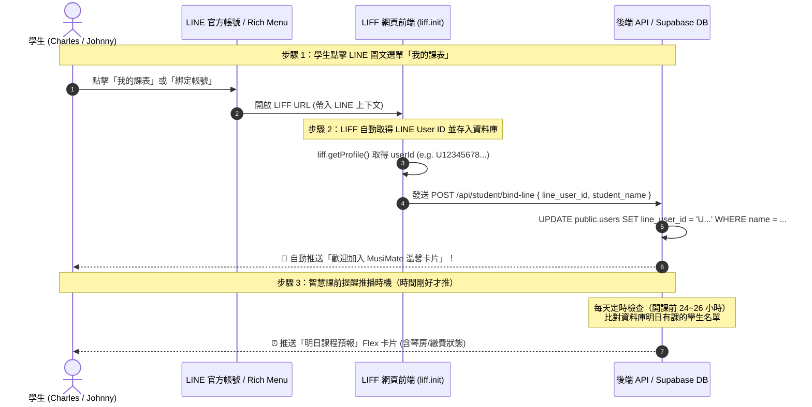

# 學生資料登錄與 LINE LIFF 身分自動辨識綁定說明書 (student_data_input.md)

本文件說明：
1. **新增學生（Charles & Johnny）資料庫結構與課表定義**
2. **LINE LIFF 如何自動辨識學生身分並補上 LINE ID**
3. **「點選我的課表 ➔ 推送預約課程」的資料庫查詢邏輯**

---

## 📌 一、 新增學生資料規格 (Student Data Specifications)

### 學生 1：Charles
* **授課老師**：張老師 (`Teacher Chang`)
* **上課樂器**：鋼琴 (Piano)
* **上課時間**：每週一、週三 19:30 - 21:30
* **週期範圍**：從明天 (2026-08-26) 起共 10 堂課
* **繳費方式**：**已繳費** (`payment_status: 'paid'`, `payment_type: 'prepaid'`)
* **LINE ID 狀態**：尚未綁定 (`line_user_id: NULL`，待學生透過 LIFF 首次開啟時自動補上)

#### Charles 10 堂課程明細：
1. `2026-08-26 (三) 19:30 - 21:30` (第 1 堂)
2. `2026-08-31 (一) 19:30 - 21:30` (第 2 堂)
3. `2026-09-02 (三) 19:30 - 21:30` (第 3 堂)
4. `2026-09-07 (一) 19:30 - 21:30` (第 4 堂)
5. `2026-09-09 (三) 19:30 - 21:30` (第 5 堂)
6. `2026-09-14 (一) 19:30 - 21:30` (第 6 堂)
7. `2026-09-16 (三) 19:30 - 21:30` (第 7 堂)
8. `2026-09-21 (一) 19:30 - 21:30` (第 8 堂)
9. `2026-09-23 (三) 19:30 - 21:30` (第 9 堂)
10. `2026-09-28 (一) 19:30 - 21:30` (第 10 堂)

---

### 學生 2：Johnny
* **授課老師**：張老師 (`Teacher Chang`)
* **上課樂器**：鋼琴 (Piano)
* **上課時間**：每週一 17:00 - 19:00 與 每週四 19:30 - 21:30
* **週期範圍**：從昨天 (2026-08-24) 起至今年年底 (2026-12-31)
* **繳費方式**：**每堂課完成後才繳費** (`payment_status: 'pay_per_lesson'`, `payment_type: 'postpaid'`)
* **LINE ID 狀態**：尚未綁定 (`line_user_id: NULL`，待學生透過 LIFF 首次開啟時自動補上)

---

### 學生 3：Lin
* **授課老師**：張老師 (`Teacher Chang`)
* **上課樂器**：鋼琴 (Piano)
* **上課時間**：每週三、週六 上午 10:00 - 12:00
* **週期範圍**：今天 (2026-08-25) 起先預約 10 堂課
* **繳費方式**：**每次課後現金繳費** (`payment_status: 'pay_per_lesson'`, `payment_type: 'postpaid'`)
* **LINE ID 狀態**：**✅ 已成功綁定** (`line_user_id: 'Uf2457bf35e0d6d3060b60838d9a9c91c'`)

#### Lin 10 堂課程明細：
1. `2026-08-26 (三) 10:00 - 12:00` (第 1 堂)
2. `2026-08-29 (六) 10:00 - 12:00` (第 2 堂)
3. `2026-09-02 (三) 10:00 - 12:00` (第 3 堂)
4. `2026-09-05 (六) 10:00 - 12:00` (第 4 堂)
5. `2026-09-09 (三) 10:00 - 12:00` (第 5 堂)
6. `2026-09-12 (六) 10:00 - 12:00` (第 6 堂)
7. `2026-09-16 (三) 10:00 - 12:00` (第 7 堂)
8. `2026-09-19 (六) 10:00 - 12:00` (第 8 堂)
9. `2026-09-23 (三) 10:00 - 12:00` (第 9 堂)
10. `2026-09-26 (六) 10:00 - 12:00` (第 10 堂)

---

## 🔑 二、 LINE ID 如何自動辨識並綁定？(LIFF Automatic Binding Flow)

### ❓ 問題：學生的 LINE ID 可以之後加入時再補上嗎？要怎麼自動辨識？
**回答**：**完全可以！這是標準的 LINE LIFF「無感綁定」最佳實踐流程。**

### 🛠️ 自動辨識綁定流程（3 步驟）：



### 💻 LIFF 前端自動取得與回傳 LINE ID 範例程式碼 (TypeScript / JavaScript)：
```javascript
// 在 LIFF 頁面加載時執行
import liff from '@line/liff';

async function initLiffAndAutoBind() {
  await liff.init({ liffId: process.env.NEXT_PUBLIC_LINE_LIFF_ID });

  if (!liff.isLoggedIn()) {
    liff.login();
    return;
  }

  // 1. 自動取得該使用者的 LINE 唯一識別碼
  const profile = await liff.getProfile();
  const lineUserId = profile.userId;       // e.g. "U4af4980629..."
  const lineUserName = profile.displayName; // e.g. "Charles Chen"

  // 2. 向後端發送查詢或綁定請求
  const res = await fetch('/api/student/check-binding', {
    method: 'POST',
    headers: { 'Content-Type': 'application/json' },
    body: JSON.stringify({ line_user_id: lineUserId, display_name: lineUserName }),
  });

  const data = await res.json();
  if (data.is_bound) {
    console.log('已成功自動識別學生：', data.student_name);
    // 直接渲染該學生的課表
  } else {
    console.log('尚未綁定，彈出一次性快速驗證（輸入學生姓名）');
    // 學生確認姓名後執行 UPDATE users SET line_user_id = lineUserId WHERE id = student.user_id
  }
}
```

---

## 📲 三、 業務邏輯確認：點選「我的課表」直接推送預約課程？

### ❓ 問題確認：
> 「我如果資料庫可以讀到該生ID 那他點選我的課表 我要推送接下來預約的課程資訊時 就可以直接讀他目前有預約的課程對嗎」

### 💡 回答：**完全正確！這就是最標準的架構。**

### 🔍 查詢邏輯與 SQL 範例：
當 LINE Webhook 或 LIFF 後端接收到使用者的 `line_user_id` 時：

1. **Step 1：從 `users` 找出該學生 ID**：
   ```sql
   SELECT u.id AS user_id, u.name AS student_name, s.id AS student_id, s.teacher_id
   FROM public.users u
   JOIN public.students s ON u.id = s.user_id
   WHERE u.line_user_id = :line_user_id;
   ```

2. **Step 2：撈出該學生所有「即將到來」的確認預約課程**：
   ```sql
   SELECT 
       a.id AS appointment_id,
       a.start_time,
       a.end_time,
       a.status,
       a.instrument,
       a.payment_status,
       u_teacher.name AS teacher_name
   FROM public.appointments a
   JOIN public.teachers t ON a.teacher_id = t.id
   JOIN public.users u_teacher ON t.user_id = u_teacher.id
   WHERE a.student_id = :student_id
     AND a.status = 'confirmed'
     AND a.start_time >= NOW() -- 只撈未來尚未結束的課
   ORDER BY a.start_time ASC;
   ```

3. **Step 3：LINE Bot 直接回傳 Flex Message 課表卡片**：
   - 學生點擊「我的課表」按鈕 ➔ LINE Bot 直接回傳漂亮的 Flex Message，列出接下來的鋼琴課時間、老師姓名與繳費狀態！

---

## 🗄️ 四、 資料庫新增欄位說明 (Schema Additions)

為支援上述需求，在 `supabase/schema.sql` 中新增/擴充以下欄位（原程式碼皆完整保留，新增欄位皆設有預設值，不影響既有功能）：

1. `public.users`：
   - `line_user_id VARCHAR(100) UNIQUE`：儲存 LINE 的唯一 ID。
2. `public.appointments`：
   - `instrument VARCHAR(100) DEFAULT '鋼琴 (Piano)'`：上課科目。
   - `payment_status VARCHAR(30) DEFAULT 'unpaid'`：`paid` (已繳費) / `unpaid` (未繳費) / `pay_per_lesson` (每堂課完成後繳費)。
   - `payment_type VARCHAR(20) DEFAULT 'prepaid'`：`prepaid` (預付/包堂) / `postpaid` (單堂後付)。
